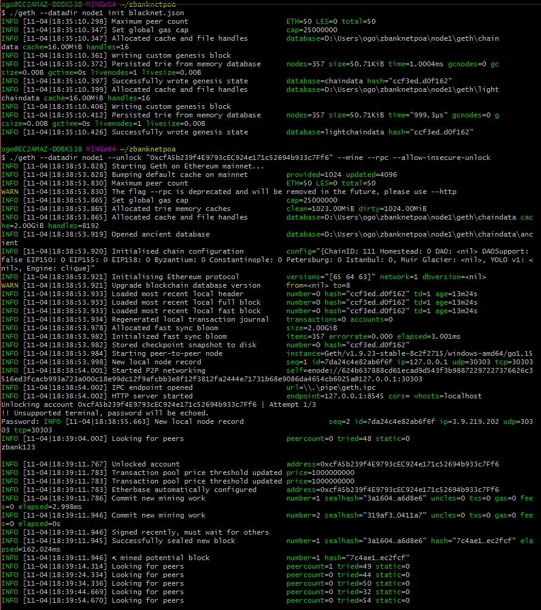
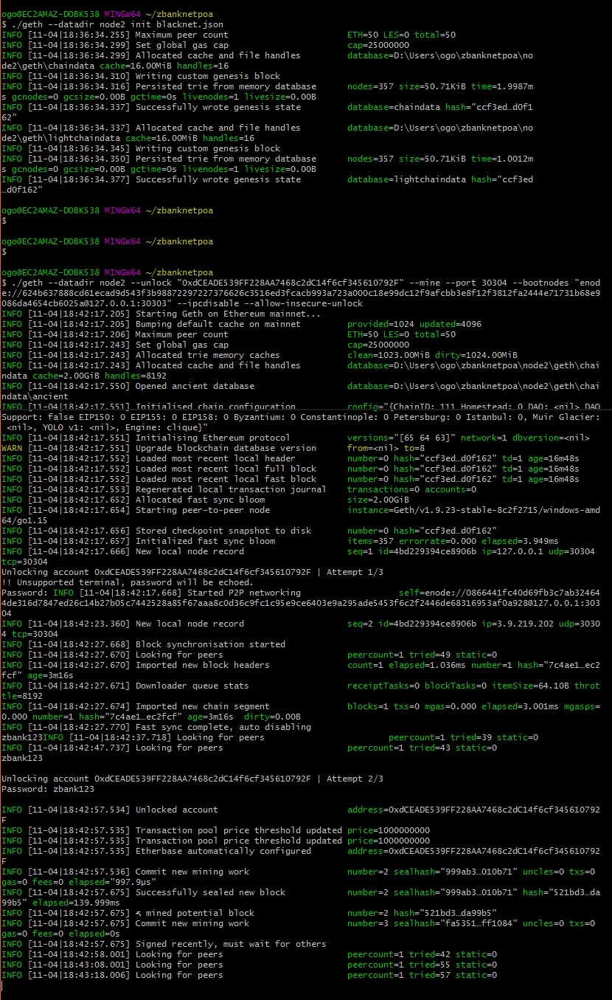
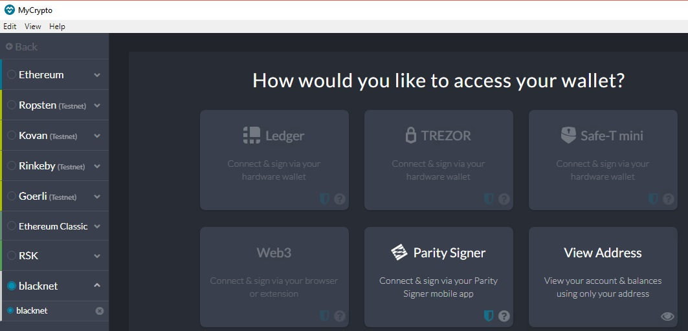
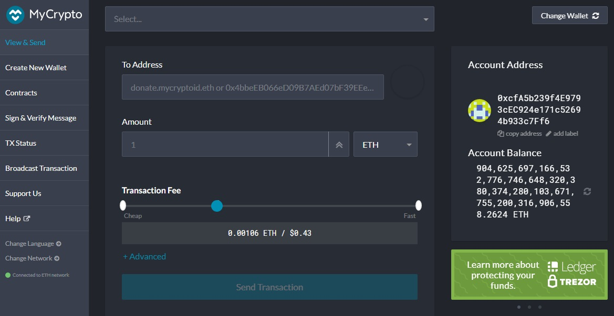
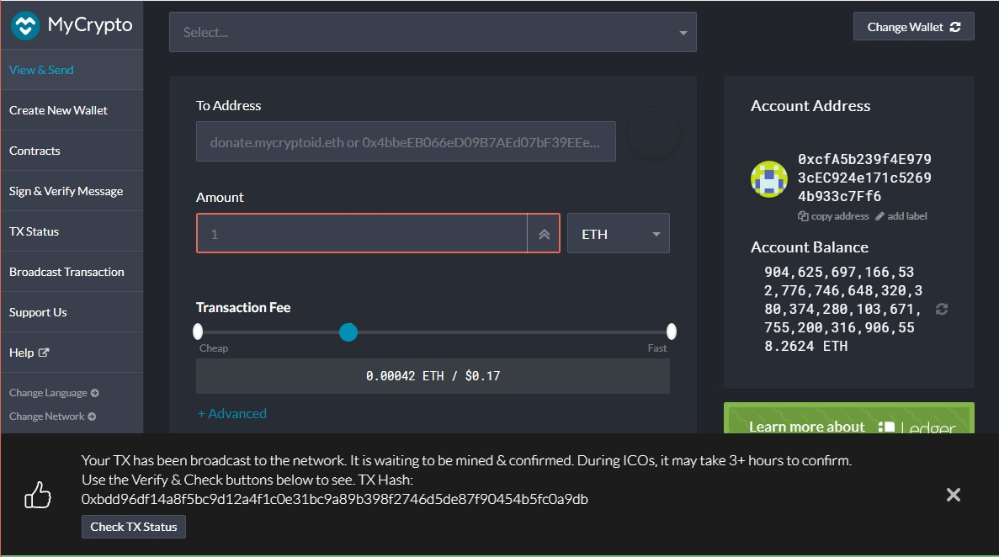
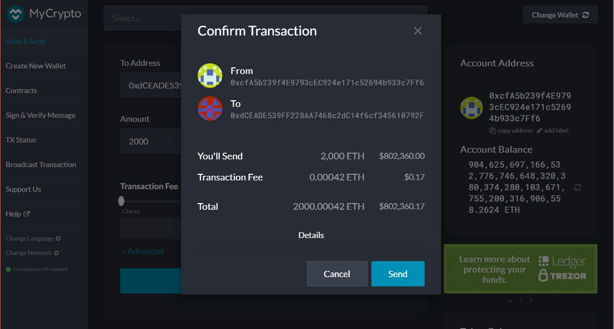
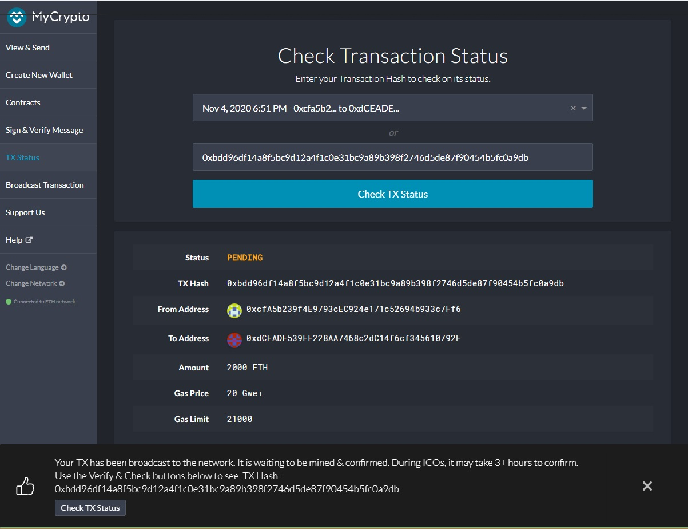

# Proof of Authority Development Chain
---
## Instructions

Instructions to develop a testnet blockchain for an organization utilizing Power of Authority.

### Environment set up for Windows10 OS

Create a new project directory for your new network.
Activate Ethereum virual environment. Create a folder <Blockchain-ZBank) that contains all blockchain tools.

### Create Nodes

Add a empty directory for nodes
mkdir node1 node2

### Get new accounts numbers from nodes to use as signers

* ./geth account new --datadir node1
* ./geth account new --datadir node2

### Running Puppeth to Create Genesis Block

Run puppeth, name your network, and select the option to configure a new genesis block.

### Initialize Node1 and Mine

Initialize the first node on the blockchain, run the command: ./geth init network1.json --datadir node1

Start mining with node1
* ./geth --datadir node1 --mine --minerthreads 1 --unlock "NODE1_address"  --rpc --allow-insecure-unlock

### Initialize Node2 and Mine

Initialize the second node on the blockchain, run the command: 
* ./geth init network1.json --datadir node2

Copy complete enode address from node1

### Launch Node2
./geth --datadir node1 --mine --minerthreads 1 --unlock "NODE1_address" --password node1/password.txt  --rpc --allow-insecure-unlock
Start mining with node2

### Setting Network info on MyCrpto

Click on "Add Custom Node", then add the custom network information that was set in the genesis.

Scroll down to choose Custom in the "Network" setting to reveal more options like Chain ID: 333

Chain ID must match previously created number.

The URL is pointing to the default RPC port on the local machine. 
* Use this same URL: http://127.0.0.1:8545

Click on the "Save & Use Custom Node" button, to use the network; double-check that it is selected and is connected.

### Unlock Keystore File
Import the keystore file from th e node1/keystore directory into MyCrypto. This will import the private key.

Confirm node1 address 

### Setup 1st Transaction
Send a transaction from the node1 account to the node2 account.

### Verify Transaction
Copy the transaction hash and paste it into the "TX Status" section of the app, or click "TX Status" in the popup.

The transaction is should now read Succesfull! C with the metadata (status, tx hash, block number, etc).

