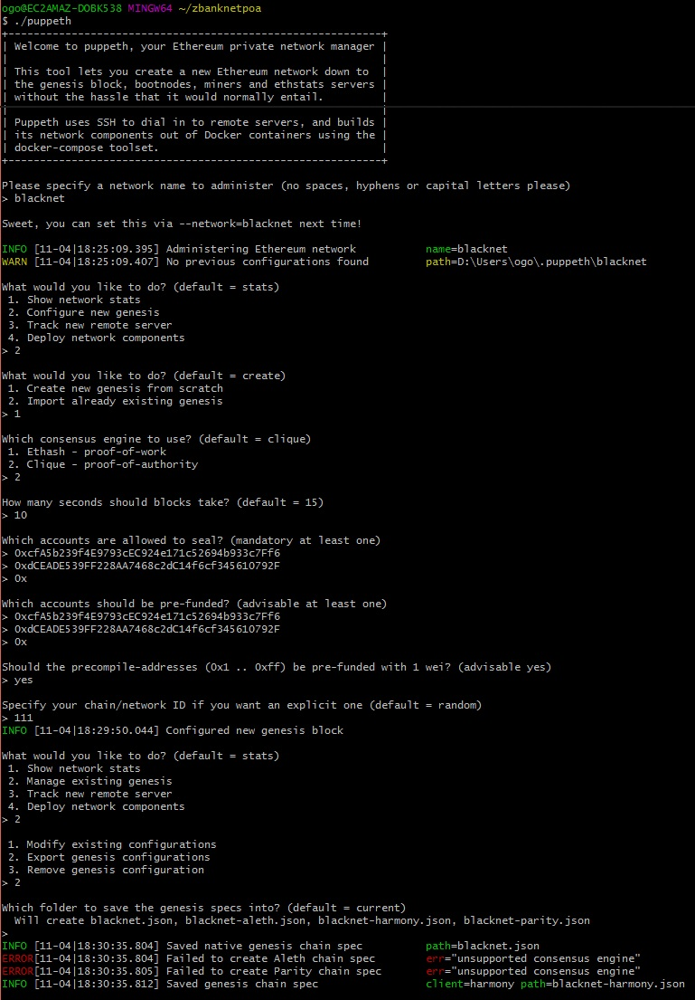

Instructions to develop a testnet blockchain for an organization utilizing Power of Authority.

Environment set up for Windows10 OS

Create ZBank environment

Create Testnet blockchain

mkdir Zbank

Create two new accounts using your neumonic phrase in myCrypto and choose the top two accounts.

