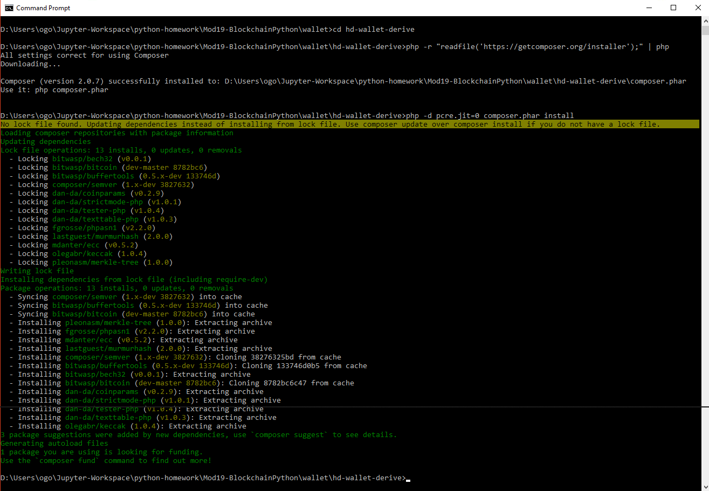

# Blockchain-Python-Homework-Columbia-FinTech-Boot-Camp

## Overview

This project allows a user to derive testnet BitCoin and Ethereum crypto wallets from a cryptocurrency account, and send transactions between wallets via Python in a command line interface. 

## Dependencies

In order to run, you must ensure that:
* The [hd-wallet-derive](https://github.com/dan-da/hd-wallet-derive) repo is added into the "wallet" directory. It was not possible to push the repo to GitHub with this included in it.  
* The following libraries and technologies are installed in your developer environment:
  * Web3
  * Bit
  * PHP
  * [Ganache](https://www.trufflesuite.com/ganache)

1. Go to BIP39 mnemonic code converter [tool](https://iancoleman.io/bip39/) and generate mnemonic phrase. 

2. Download, install and use **Ganache** to launch private ETH blockchain through the pre-generated mnemonic phrase.
    * url: http://127.0.0.1:7545
    * network ID: 5777
    * coin: ETH
    
	
3. Clone `hd-wallet-derive` Github
Clone `hd-wallet-derive` to local directory and install by entering the following commands in git-bash:
    ```bash
    git clone https://github.com/dan-da/hd-wallet-derive
    cd hd-wallet-derive
    php -r "readfile('https://getcomposer.org/installer');" | php
    php -d pcre.jit=0 composer.phar install
    ```
	
	
	
    Use `pypl` to install python library `bit` and `web3` are installed thru:
    ```shell
    pip install bit
    pip install web3
    ```

## 3. Setting Mnemonic Phrase
Within wallet directory, create `.env file` (no extension type) to store your mnemonic phrase under an object named `MNEMONIC`.

- Set this mnemonic as an environment variable, and include the one you generated as a fallback using:
  `mnemonic = os.getenv('MNEMONIC', 'insert mnemonic here')`

```python
mnemonic = os.getenv('MNEMONIC')
print(mnemonic)
```

## 4. Install wallet.py
Within wallet directory, run `wallet.py` in Anaconda Prompt.
- `python wallet.py`

The [wallet.py](wallet.py) file supports the following coins:
    | Coin | Symbol | Global Variable |
    | --- | --- | --- |
    | Ethereum | `eth` | `ETH` |
    | Bitcoin Testnet | `btc-test` | `BTCTEST` |
---

## 5. How to use functions to transfer coins?
To transfer coins, use these functions in Anaconda Prompt,
- `from wallet import *`
- `create_tx(COIN_NAME,"ADD SENDER ACCOUNT","ADD RECIPIENT ACCOUNT",AMOUNT)`
- `send_tx(COIN_NAME,"ADD SENDER ACCOUNT","ADD RECIPIENT ACCOUNT",AMOUNT)`

## 6. Expand the Wallet!

To expand the account, settint number of accounts need in variable `numderive` in `wallet.py`.

You can add coins into `coins` list in `wallet.py`
