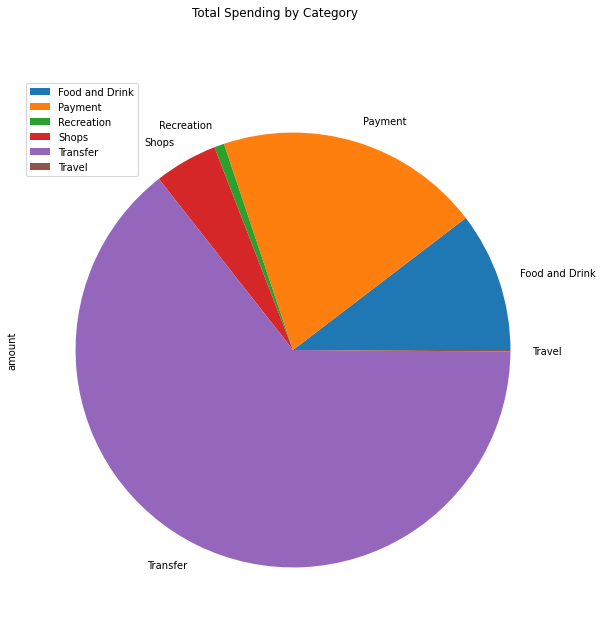

# Financial Report

1. **Budget Analysis:** Summarize the transaction data from the budget analysis and include images for each chart and table produced.

## Total Spending by Categories:

## Monthly Spending

2. *Retirement Planning:* Summarize the retirement portfolio analysis and include the charts for the Monte Carlo simulation.

## 30-yr performance simulation of 60% SPY allocation and 40% AGG allocation portfolio

## Histogram of 90% confidence interval for cumulative returns ending at 20 years

